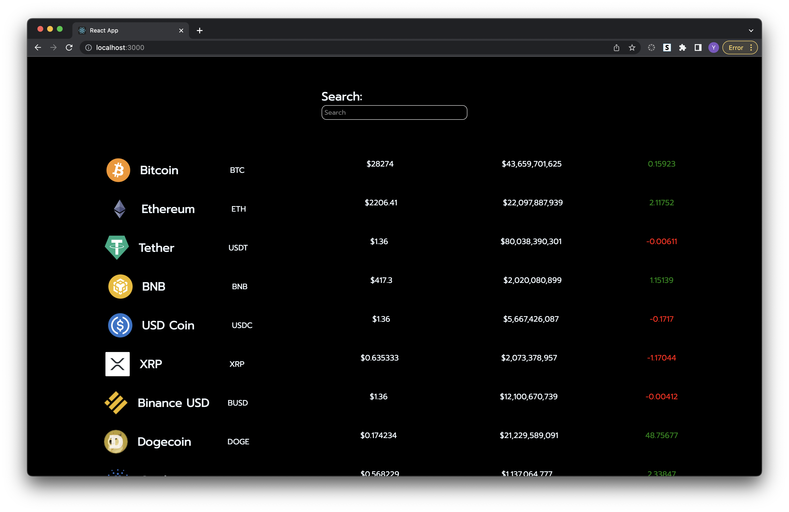

# Simple Cryptocurrency Search Application

## Motivation

Due to the growing populatiry of the crypto market, I wanted to test out the CoinGecko API and make my own cryptocurrency search application in React.js

## Technologies used

- React.js
- Axios
- CoinGecko API

## Future Improvements?

- Use Graph.js to get the yearly changes for each crypto page
- Create a baadckend for the user to virtually buy a cryptocurrency or be able to track it
# cryptocurrency-tracker
